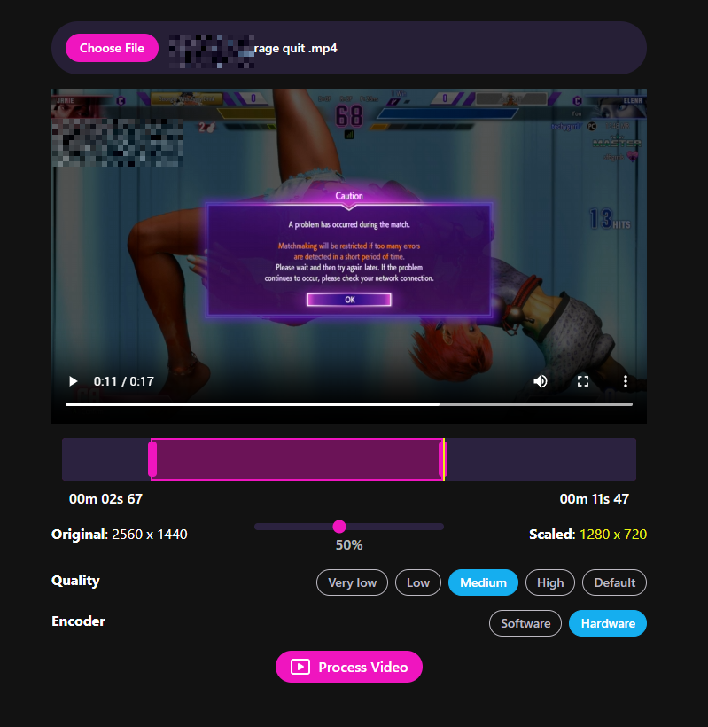
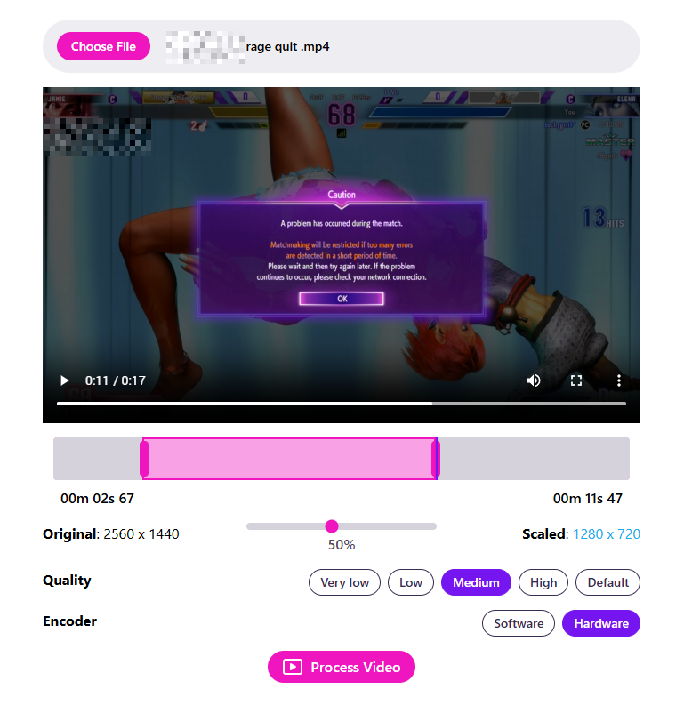

# 📺 trimrrr

🌐🔗 https://trimrrr.pages.dev

**trimrrr** is a simple web app for trimming, resizing, and compressing videos.

**trimmrrr** runs exclusively in the browser and uses web APIs to process the videos so videos never leave your browser.

## Features

- Video files are processed in the browser using the [WebCodecs API](https://developer.mozilla.org/en-US/docs/Web/API/WebCodecs_API)
- Drag and drop interface to adjust the start and end times of the video
- Drag and drop a video onto the file area or click the "Choose file" button to pick a video
- Scale the size of the video by percentage and see the target resolution
- Adjust the quality of the audio and video bitrate between some presets (default, high, medium, low, very low)
- Choose between hardware-accelerated encoding (recommended) and software encoding
- Remove audio
- Progressive Web App so you can "install" it and get quick access to it in your taskbar, start menu, or desktop
- Works on desktop and mobile
- Completely free, no tracking, no ads

