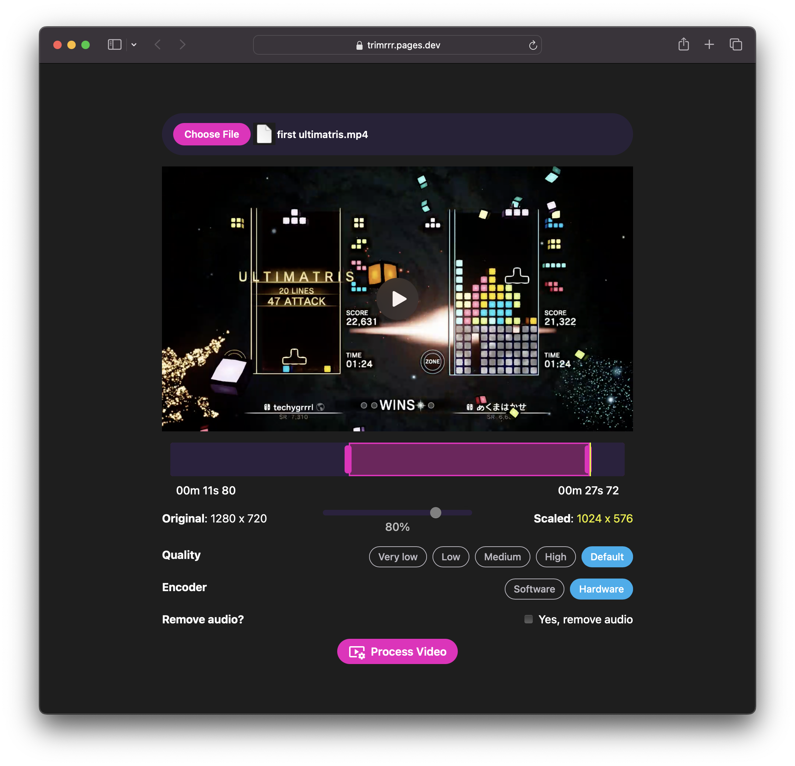

<h1 align="center">trimrrr</h1>

  

  <strong>trimrrr</strong> is a simple web app for trimming, resizing, and compressing videos.

  🌐🔗 app: <a href="https://trimrrr.pages.dev"><strong>trimrrr.pages.dev</strong></a>

  by <a href="https://techygrrrl.stream">techygrrrl</a>

---

- [Features](#features)
- [Screenshots](#screenshots)
- [Changelog](#changelog)
  - [2026-07-21 – 🔇 Remove audio + 🐛 bug fixes](#2026-07-21---remove-audio---bug-fixes)
  - [2026-07-20 – 🚀 Initial release!](#2026-07-20---initial-release)

## Features

- Video files are processed in the browser using web APIs (e.g. the [WebCodecs API](https://developer.mozilla.org/en-US/docs/Web/API/WebCodecs_API)) so videos never leave your browser
- Drag and drop interface to adjust the start and end times of the video
- Drag and drop a video onto the file area or click the "Choose file" button to pick a video
- Scale the size of the video by percentage and see the target resolution
- Adjust the quality of the audio and video bitrate between some presets (default, high, medium, low, very low)
- Choose between hardware-accelerated encoding (recommended) and software encoding
- Remove audio
- Progressive Web App so you can "install" it and get quick access to it in your taskbar, start menu, or desktop
- Works on desktop and mobile. Platforms tested:
    - Windows &rarr; Chrome
    - Windows &rarr; Edge
    - macOS &rarr; Safari
    - macOS &rarr; Chrome
    - Android &rarr; Chrome
    - Android &rarr; DuckDuckGo
    - iOS &rarr; Safari
- Completely free, no tracking, no ads

To read more about how this was built and my motivations behind it, you can read this blog post: https://blog.techygrrrl.stream/i-made-a-video-editor-with-mediabunny-a-library-that-ai-thinks-doesnt-exist

## Screenshots

On macOS:

The screenshots below are a bit older and are missing some features.

On Windows, dark mode:

On Windows, dark mode:

## Changelog

### 2026-07-21 – 🔇 Remove audio + 🐛 bug fixes

- Bug fixes for Android
- Layout improvements
- Feature: Remove audio
- Update branding and documentation

### 2026-07-20 – 🚀 Initial release!

- Initial release!
    - Scaling the video
    - Changing the quality (bitrate)
    - Choosing an encoder
